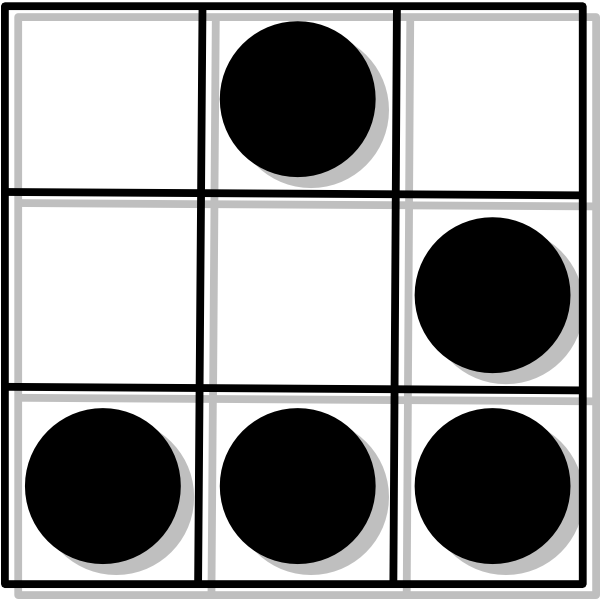

  

# Red-Team-Field-Guide

Field guide to gather low-hanging fruits. In this repository we are trying to only go for the fastes ways to get a quick.

## Table of Contents

- [1 Reconaissance](1-reconnaissance.md)
- [2 Weaponization](2-weaponization.md)
- [3 Delivery](3-delivery.md)
- [4 Exploitation](4-exploitation.md)
- [5 Installation](5-installation.md)
- [6 Command & Control](6-command-and-control.md)
- [7 Actions on Objectives](7-actions-on-objectives.md)
